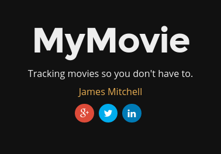

## &ldquo;Louie, I think this is the beginning of a beautiful friendship.&rdquo;

The first talk covers the things that should be done before writing any code,
such as gathering requirements, and organising tools and services we will use later.

<!--more-->

 * [view the slides online](talk.html)
 * [download the PDF version](MyMovie1.pdf)
