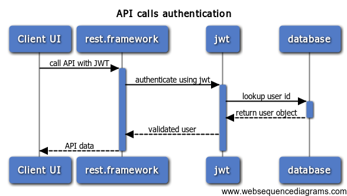

## &ldquo;Show me the money!&rdquo;

The second talk covers writing the server-side of the application.
Setting up a database to store user and movie data, then documenting and writing an API
to access the data.

<!--more-->

* [view the slides online](talk.html)
* [download the PDF version](MyMovie2.pdf)
