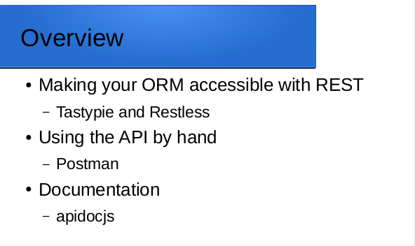

An introduction to adding a REST API to a Python Django application, tools to access the API "by hand", and to document it.
<!--more-->

## [Slacker's Guide to REST API](Slackers-Guide-REST.pdf)

Postman files from the presentation
* [Environment definition](Reeder-Local.postman_environment.txt)
* [Collection of endpoints](Reeder-Demo.postman_collection.txt)
